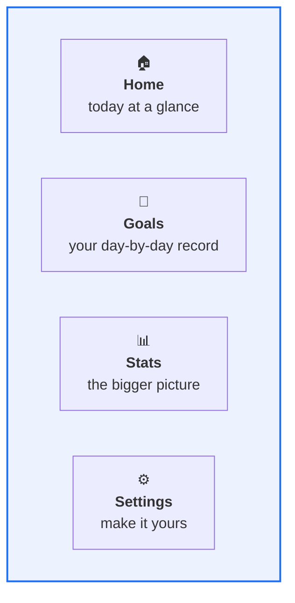
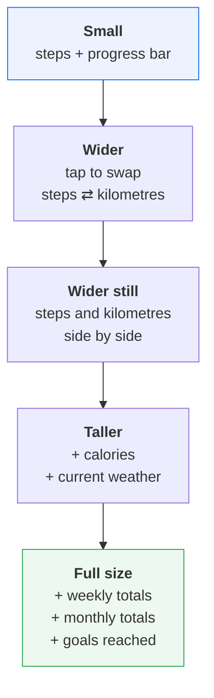
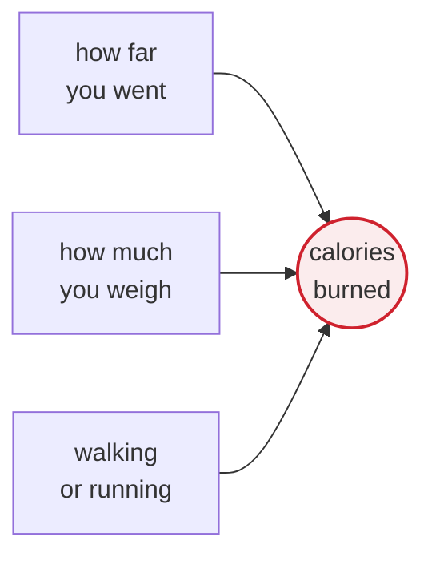
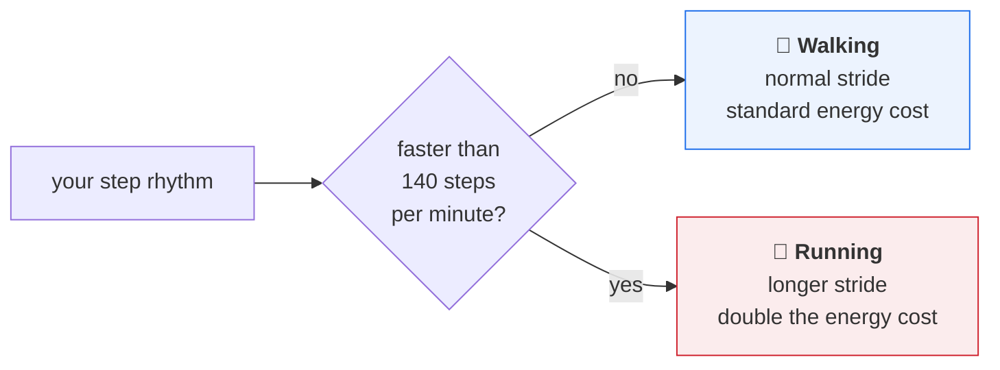
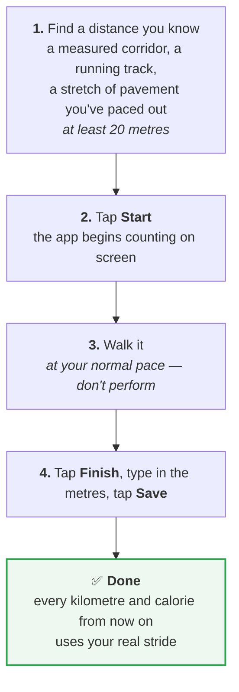

# StepMaster

**A step counter for Android that stays on your phone.**

StepMaster counts the steps you take during the day, works out how far you walked and
how many calories you burned, and keeps a record so you can look back at your week,
your month, and every goal you've hit.

No account. No sign-up. No data leaving your phone.

---

## What you get

### 🏠 Home — today at a glance

A ring that fills up as you walk toward your daily goal, with your step count in the
middle. Below it, three things worth knowing right now: the current weather, the
kilometres you've covered, and the calories you've burned.

Cross 10,000 steps — the World Health Organization's daily recommendation — and the
app says well done.

### 🎯 Goals — your day-by-day record

Every day you've used the app, newest first: how many steps, what your goal was, how
far you went, how many calories. A green tick if you made it, a red cross if you
didn't.

It's a track record, not a scoreboard. Days you missed stay visible, because that's
what makes the days you hit mean something.

### 📊 Stats — the bigger picture

A bar chart of the current week, Monday to Sunday, with a line across it marking your
goal so you can see at a glance which days cleared it. Underneath: total kilometres
this week, total this month, and how many goals you've reached since you started.

### ⚙️ Settings — make it yours

Turn counting on or off. Set your own daily goal if 10,000 isn't your number. Tell the
app your height and weight so its calculations fit *you*. And calibrate your stride —
the feature that turns a rough estimate into a real measurement. More on that below.

---

## The home-screen widget

Put StepMaster on your home screen and check your progress without opening anything.

Resize it, and it changes what it shows to fit the space:

It updates as you walk, so it's never showing you yesterday's number.

---

## How it measures you

### Steps

Modern phones have a dedicated step-counting chip — a tiny piece of hardware separate
from the main processor, designed to recognise the rhythm of walking while using almost
no battery. StepMaster reads that chip. It doesn't guess from movement, and it doesn't
need the screen on.

This is also why it's gentle on your battery: the counting isn't really happening in
the app, it's happening in a chip that's already running.

### Distance

Distance is steps multiplied by the length of one step. Simple — the interesting part is
where the length comes from.

By default the app estimates it from your height, using a ratio established by sports
medicine research: your stride is about 41.5% of how tall you are. Someone 1.80 m tall
has a stride of roughly 75 cm.

That's a good starting point. It's also an average, and you are not an average — which
is what [calibration](#make-it-exact-calibrate-your-stride) is for.

### Calories

Here's where most step counters get vague and StepMaster tries to be honest.

The number comes from the metabolic equations used in sports medicine, and it depends on
three things: **how far you went**, **how much you weigh**, and **whether you were
walking or running**.

Weight matters because moving a heavier body over the same ground takes more energy.
That's why the app asks — not out of curiosity, but because without it the number would
be a guess.

### Walking or running?

The app can tell the difference, and it matters: running the same kilometre burns
roughly **twice** the calories of walking it.

It works it out from your rhythm — how quickly the steps are coming. Above about 140
steps a minute, you're running, and the app switches to running maths: a longer stride
and double the energy cost.

There's a subtlety worth knowing, because it surprises most people: **walking faster
doesn't burn more calories per kilometre.** You burn more per *minute*, certainly — but
you also finish the kilometre sooner, and the two even out. A brisk walk and a stroll
cost about the same per kilometre. Running is genuinely different, and that's the line
the app draws.

### Your numbers are recorded as they happen

Calories and distance are worked out at the moment you take the steps, and written down
straight away.

This sounds like a technicality but it changes what the app can tell you. If you lose
weight, last month's calories stay as they were — they were true when you burned them,
and rewriting them would erase your own history. If you sprint for the bus this
afternoon, that sprint is counted as a sprint, permanently, because the app noticed
while it was happening.

---

## Make it exact: calibrate your stride

Everyone's stride is different — leg length, gait, the way you happen to walk. Real
strides vary by 10 to 15% from the height-based estimate. Over 10,000 steps that's
several hundred metres.

So the app lets you measure yours, once, in about two minutes:

The app checks your answer makes sense. Too short a walk and it'll ask you to try again
with a longer one — a few steps carry too much error to trust. A wildly implausible
result (usually someone typing centimetres where the app asked for metres) gets flagged
rather than silently saved.

Changed your mind? One button puts it back to the height-based estimate.

**Worth it?** Calibration takes the typical error from around 12% down to around 4%. If
you care whether the app says 5.2 km or 5.9 km, yes.

---

## Weather

Home shows the current temperature and conditions for where you are. It's there for a
practical reason: whether you'll want that evening walk depends quite a lot on whether
it's raining.

The app asks for approximate location only — the neighbourhood, not the street. It uses
it to look up the weather and nothing else.

---

## What StepMaster doesn't do

Just as important as the feature list:

- **It doesn't track where you go.** No GPS trails, no route maps, no history of places.
  Location is used once in a while to fetch the weather, and that's the extent of it.
- **It doesn't send your data anywhere.** Your steps, weight, height and history live on
  your phone. There's no server to upload them to.
- **It doesn't need an account.** Install it and it works. Nothing to sign up for,
  nothing to log into.
- **It doesn't show ads** and doesn't sell anything.
- **It doesn't nag.** One quiet, permanent notification while counting is running —
  Android requires it, and it's what allows counting to continue with your screen off.
  That's all you'll hear from it.

---

## Getting started

1. **Install and open the app.** It'll ask for two permissions: activity recognition
   (to read the step chip — counting won't work without it) and approximate location
   (for the weather — decline it and everything else still works fine).
2. **Go to Settings and switch counting on.**
3. **Enter your height and weight**, and your daily goal if you'd like something other
   than 10,000.
4. **Calibrate your stride** when you have two minutes and a distance you can measure.
   Not required — but it's the difference between an estimate and a measurement.
5. **Add the widget** to your home screen, if you like seeing your progress without
   opening apps.

### What you need

Android 8.0 or newer, and a phone with a step-counting sensor — essentially every phone
made in the last decade.

Note that the counter needs real hardware: it won't work in an emulator, only on an
actual phone.

---

## Common questions

**Does it drain my battery?**
Very little. The counting is done by a low-power chip that's already running whether or
not you have the app installed. StepMaster reads the number; it doesn't do the work.

**Why does it want my weight?**
Calorie burn depends on body mass — moving more weight over the same distance takes more
energy. Without it, calorie figures would be made up. It's stored on your phone and
never leaves it.

**I've lost weight. Do my old numbers change?**
No, and that's deliberate. Each day is recorded with the height and weight you had *that
day*. Your history stays a record of what actually happened rather than a recalculation
of what it would have been.

**What if I restart my phone?**
Your count is safe. The app recognises a restart and keeps going from where it was.

**Does it count steps if the app is closed?**
Yes, as long as counting is switched on in Settings. That's what the permanent
notification is for.

**Can I turn counting off?**
Any time, from the switch in Settings. Useful if you're heading somewhere you'd rather
not have it running.

**How accurate is it?**
Steps come from a dedicated sensor, so they're reliable. Distance is within roughly 12%
using the height estimate, and roughly 4% once you've calibrated. Calories come from
sports-medicine equations rather than a rule of thumb — but bear in mind that *any*
calorie figure, from any app or fitness tracker, is an estimate. Treat it as a
consistent measure of your own effort rather than a precise physiological reading.

---

## Still to come

Honest about the rough edges:

- A freshly added widget shows 0 °C until the first weather check completes. It should
  say "checking" rather than showing a number that isn't real yet.
- The weekly chart covers the current week only — no way yet to look back at previous
  weeks.
- No way to export your history, or move it to a new phone.
- Interface and text are in Italian only.

---

## About

StepMaster started as a university project and has been substantially rebuilt since:
the calorie and distance calculations were rewritten around published sports-medicine
equations, the app learned to tell walking from running, stride calibration was added,
and the widget was rebuilt to resize properly.

It's a personal project, built for the pleasure of getting the details right.
